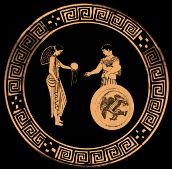
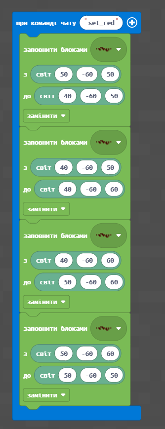
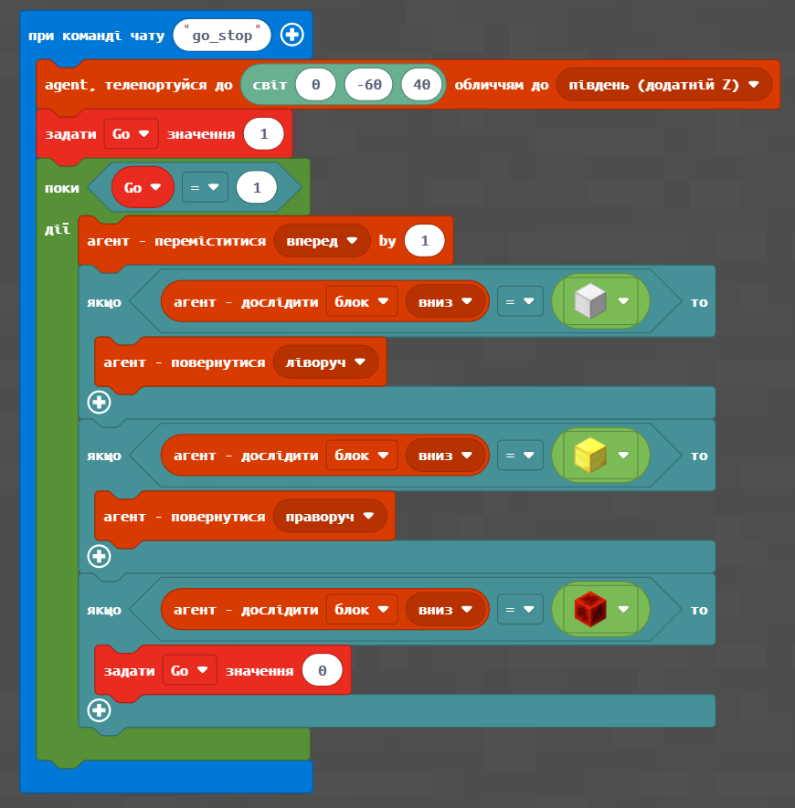
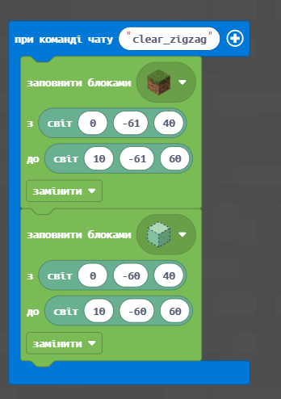
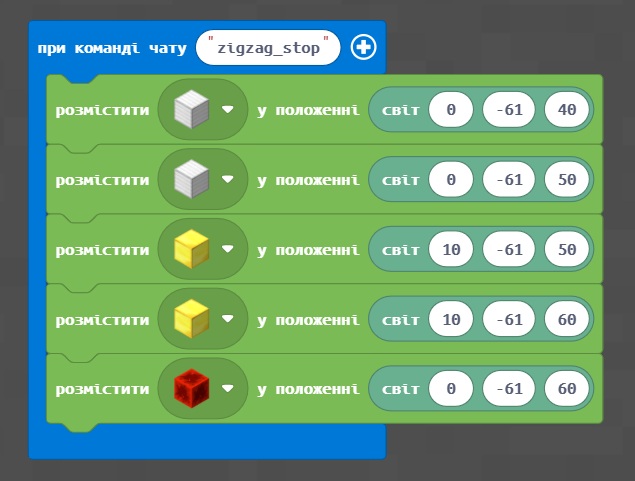

# Нитка Аріадни. Як вийти з лабіринту

#### Опис


Сьогодні ми продовжимо будувати лабіринти й навчимося виходити з них за допомогою нитки Аріадни


## Згадаймо🤔

1. Навіщо потрібно встановлювати покажчики?&#x20;
2. Що таке редстоун? &#x20;

## Сьогодні ми:

1. Вийдемо з лабіринту!&#x20;
2. Навчимося розміщувати пил редстоуну за допомогою коду.&#x20;
3. Навчимо агента рухатися так, щоб він йшов туди, де є пил редстоуну.&#x20;
4. Створимо блоки управління.
5. Запустимо фейєрверки!

> **Усі ці навички обов'язково знадобляться під час виконання вашого проєкту!**😉


Уся Аттика (Стародавня Греція) була занурена в глибоку печаль. З острова Крит приходили жахливі новини: у величезному палаці-лабіринті, що відрізнявся складною системою розташування кімнат і коридорів, оселилося чудовисько з людським тулубом і головою бика — Мінотавр. Воно пожирало людей, і цар Криту Мінос вимагав від Афін жертв - сім юнаків і сім дівчат.

Молодий **Тезей** (син Посейдона і земної жінки Ефри, цариці Афін) вирішив битися з Мінотавром і став збиратися в дорогу. Корабель з юнаками і дівчатами успішно прибув на Крит. Тезей знаходився в групі приречених молодих людей, яких повинні були віддати Мінотавру. Донька Міноса, красуня **Аріадна,** одразу звернула на нього увагу. Афродіта запалила в її серці любов до прекрасного юнака, і Аріадна вирішила допомогти Тезею знищити Мінотавра.&#x20;

Але Аріадна знала: навіть якщо Тезей переможе Чудовисько, він не зможе вибратися з лабіринту. І ось напередодні поєдинку дівчина потайки прийшла до Тезея і принесла йому непереможний **меч батька і клубок ниток**. Тримаючись за нитку клубка Аріадни, герой зміг вийти живим з лабіринту.&#x20;

_**Сьогодні ми з вами створимо таку нитку, яка нам теж допоможе вийти з лабіринту!**_


Важливою властивістю лабіринту є те, що з нього **дуже складно вийти**. І однією зі стратегій, що дозволяє це зробити, є залишення після себе **покажчика** про те, що ви вже пройшли певну точку.\
В Minecraft ми можемо за агентом розміщувати пил **редстоуну** — він допоможе нам вибратися з лабіринту в майбутньому.

Спершу <mark style="color:orange;">**(1)**</mark> — навчимося розміщувати пил редстоуну за допомогою коду. Сформуємо найпростішу траєкторію майбутнього руху агента — квадрат.&#x20;

<mark style="color:orange;">**(2)**</mark> Далі поставимо агента в точку на одній з вершин квадрату в напрямку руху,&#x20;

<mark style="color:orange;">**(3)**</mark> Далі навчимо агента рухатися так, щоб він йшов туди, де є пил редстоуну.

### **Створення траєкторії пересування**

| Завдання  | <table data-header-hidden><thead><tr><th></th></tr></thead><tbody><tr><td><ol><li>Сформуйте квадрат з редстоуну від точок <strong>(50;-60;50)</strong> до точки <strong>(40;-60;60)</strong>.</li><li>Сформуйте квадрат з редстоуну від точок <strong>(100;-60;100)</strong> до точки <strong>(110;-60;110).</strong> </li><li>Сформуйте довільний квадрат з редстоуну в довільній точці мапи.</li></ol></td></tr></tbody></table> |
| --------- | ---------------------------------------------------------------------------------------------------------------------------------------------------------------------------------------------------------------------------------------------------------------------------------------------------------------------------------------------------------------------------------------------------------------------------------- |
| Код       |                                                                                                                                                                                                                                                                                                                                                                                                         |
| Результат |                                                                                                                                                                                                                                                                                                                                             |

### Блоки управління

| Завдання  | 
Створіть управляючі блоки: 
<ul><li>блок смарагду (зелений) в точці старту <strong>(0;-61;40)</strong>, </li><li>блок заліза (білий) — в місці повороту ліворуч <strong>(0;-61;50)</strong>, </li><li>блоки золота (жовті) — в місцях повороту праворуч <strong>(10;-61;50)</strong>, <strong>(10;-61;60)</strong>, </li><li>блок редстоуну (червоний) в точці закінчення пересування</li></ul> |
| --------- | ----------------------------------------------------------------------------------------------------------------------------------------------------------------------------------------------------------------------------------------------------------------------------------------------------------------------------------------------------------------------------------------------------- |
| Код       | .png>)                                                                                                                                                                                                                                                                                                                                                                     |
| Результат |                                                                                                                                                                                                                                                                                                                |

### Прохід агента за показниками управління

| Код: | 
 
 |
| ---- | ---------------------------------------------------- |

### Фейєрверки


Дослівно «feuerwerk» з німецької мови можна перекласти як «робота вогню», проте винайшли фейєрверки зовсім не в Німеччині.

Ритуальні церемонії з багаттями і смолоскипними ходами відбувалися задовго до початку нової ери у різних народів світу. Як правило, вони були пов'язані з посівними роботами або військовими походами.&#x20;

Одним із перших **прообразів петарди** можна вважати **метання снарядів** з грецьким вогнем — це горюча суміш на основі селітри. Вони використовувалися для воєнних цілей, під напором повітря стовп вогню виривався зі спеціальних довгих трубок і вражав ворога.&#x20;

Точна дата винаходу фейєрверків невідома, але історики припускають, що це сталося в I столітті до нової ери в Стародавньому Китаї в період правління династії Хань. Прообраз сучасного салюту з'явився в Піднебесній завдяки простій випадковості. Одного разу в багаття потрапило зелене стебло бамбука. Його сік при нагріванні перетворився на пару, заповнив закупорену порожнисту частину рослини, і через якийсь час стебло з тріском вибухнуло.


Ми можемо вручну сформувати інструмент запуску фейєрверків:

| 1. Додамо до інвентаря гравця розподілювач, фейєрверк, натискну панель та пил редстоуну. |  |
| ---------------------------------------------------------------------------------------- | ----------------------------------------------------------------------------------------- |
| 2. Поставимо розподілювач (зверху)                                                       |  |
| 3. Проведемо доріжку з пилу редстоуну до розподілювача                                   |  |
| 4. Додамо натискну панель                                                                |  |
| 5. Натиснемо на створений розподілювач правою клавішею миші                              |  |
| 6. Перенесемо фейєрверки з набору інструментів гравця до набору в розподілювач           |  |
| 7. Запустимо прохід агента по натискній панелі                                           |  |

### Творчі завдання

1. Додайте **точки запуску фейєрверків** за маршрутом проходження агенту.
2. \*Розставте точки запуску фейєрверків по мапі та за допомогою керуючих блоків задайте **маршрут проходження агента** так, щоб він запускав всі фейєрверки.
3. \*\* Додайте можливість окрім фейєрверків запускати щось інше (наприклад підривати вибухівку)

### Очищення робочого простору


Досить часто виникає ситуація, коли ви щось побудували на мапі, але після цього **хочете змінити схему розміщення блоків** (у нашому випадку — прибрати фейєрверки чи місця вибуху).&#x20;

Для цього зручно заповнити простір, на якому ви працювали над землею, **блоками повітря** (значення **4** за другою координатою **(y)**, в той час як на рівні землі (значення **3** за другою координатою **(y)**)


Для підготовки простору керуючих блоків для наступного завдання **очистимо** його та встановимо блоки по новій

| Код       | 
  
 |
| --------- | ------------------------------------------------------------------------------------------------- |
| Результат |            |

### Повернення агента за доріжкою з редстоуну

В попередньому завданні агент йшов за керуючими блоками. Додамо невеличке доповнення до програми руху агента так, щоб він залишав за собою слід з пилу редстоуну. А далі — напишемо програму, яка дозволить повертати агента на вихідне місце.

| Код       | 
 
 |
| --------- | -------------------------------------------------------------------------------------------------------------------------- |
| Результат |                                     |

### Повернення агента за доріжкою з редстоуну.

Додамо код повернення агента за прокладеною лінією пилу редстоуну. Для його використання після проходження агентом шляху за керуючими блоками і залишення після себе сліду, виконайте команду чату **go\_red**, щоб агент повернувся у вихідне положення.

| Код       |  |
| --------- | ---------------------------------------------------------------------------------------------------- |
| Результат |  |
|           |                                                                                                      |

### Лабіринт із поверненням.

У цьому завданні зберемо попередні напрацювання до загального проєкту: побудови лабіринту, у який заходить агент і з якого він може повернутися.

### **Створимо квадарти**, що вкладені один в одний

| Код       |  |
| --------- | ----------------------------------------------------------------------------------------- |
| Результат |  |
|           |                                                                                           |

### Зробимо переходи між рівнями

| Код       |  |
| --------- | ----------------------------------------------------------------------------------------- |
| Результат |  |
|           |                                                                                           |

### Додамо загородження між рівнями

| Код       |  |
| --------- | ----------------------------------------------------------------------------------------- |
| Результат |  |
|           |                                                                                           |

### **Додамо керуючі блоки**

| **Код**       |  |
| ------------- | ----------------------------------------------------------------------------------------- |
| **Результат** |  |
|               |                                                                                           |

Реалізуємо **прохід агенту** лабіринтом із залишанням за собою сліду з редстоуну.

| Код       |  |
| --------- | ----------------------------------------------------------------------------------------- |
| Результат |  |
|           |                                                                                           |

Додамо **код повернення** (він такий самий, що і код повернення агента за редстоуном, який ми писали вище).

| Код       |  |
| --------- | ---------------------------------------------------------------------------------------------------- |
| Результат |             |
|           |                                                                                                      |

### Творчі завдання

1. Додайте можливість запуску фейерверка при досягненні агентом **центра лабіринту** (фейерверк буде активуватися за рахунок енергії, що передається від блоку редстоуну в центрі через пил редстоуну, що його прокладає агент).
2. `*` Реалізуйте підрив лабіринту, коли аент досягає центру.
3. `**` Реалізуйте власний лабіринт із унікальним місцем переходу між рівнями, загородженнями та сигналами. Реалізуйте «таємні місця», що активізуються, якщо ви збилися з дороги (фейерверк, вибуівка, тощо). Пройдіть лабіринт агентом та власноруч, запишіть ваші дії на відео, **викладіть в YouTube**.


На наступному занятті ми продовжимо подорож по Стародавньому Світу і ви отримаєте навички, які стануть в нагоді для вашого проекту😉

